# **Project_Maui**
## **Using News Sentiment to Predict Stoci Price Movements**

Program that allows a user to choose a company from the S&P 500 and run a logistic regression model to predict the price movement of this company's stock on the next trading day based on current sentiment (Vader) of Reuters news articles related to this company. 

## **UX/UI Showcase**
### _**Choose a Company**_
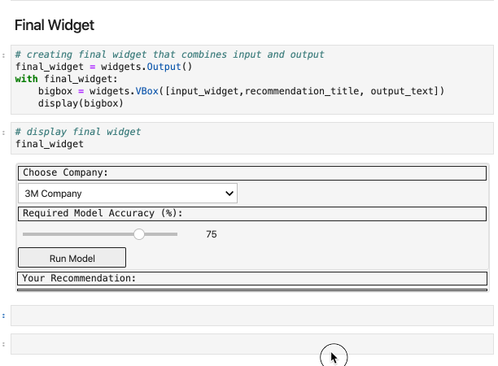

### _**Required Model Accuracy of 20%**_

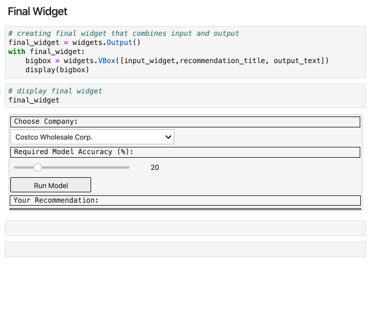

### _**Required Model Accuracy of 63%**_

_Please wait till the end for modified recommendation. Thank you for your patience!_
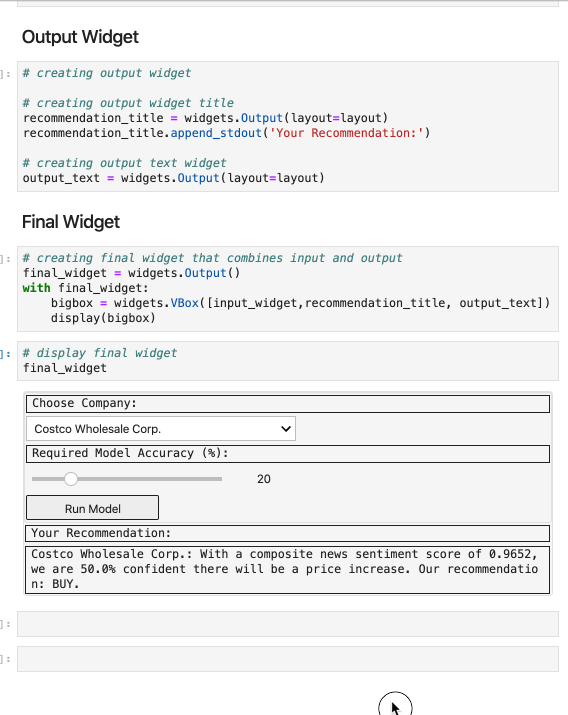


### **Original Goal**

_Should there be access to hourly data on stock prices and news sentiments_

Predict intraday movement in stock price between the current point in time and the end of the trading day to determine if a trade will be profitable by end of day. 
Machine learning model to be implemented  that took in average news sentiment between h0 and h-24 (h = hour) as features, and intraday change in price between h0 and 4pm as the target on a rolling single-day basis historically .

NOTE: You must have active keys from the following APIs to run this program:
* [IEX Finance](https://iexcloud.io/)
* [News API](https://newsapi.org/)

_**File to run:**_
**[project_code > master_function](project_code/master_function.ipynb)**

[_**Link to Project Proposal**_](https://docs.google.com/presentation/d/1oC39MhMv8g4PFlXyPxXt4JyFgs-H_WBuySMOxhCRtT4/edit?usp=sharing)


## **Data**

### _**Cleaning and Curation**_

**News Sentiments**

* Pulled 20 Articles per day from news API 
    * Could only pull for past 30 days
    * Request limitations informed Dataframe Structure 

* Sentiments are placed into four categories: 
    * compound, positive, negative and neutral

* Cleaned up articles using Lemmatization and stop word removal
    * Marginally affected polarity score
    * Applied Vader Sentiment Analyzer to return Polarity Score

    <details><summary>
    Code (click me)
    </summary>

    ```python

    # function to tokenize text
    def tokenizer(text):
        
        # cleaning text
        sw = set(stopwords.words('english'))
        regex = re.compile("[^a-zA-Z ]")
        re_clean = regex.sub('', text)
        words = word_tokenize(re_clean)
        lem = [lemmatizer.lemmatize(word) for word in words]
        tokens = [word.lower() for word in lem if word.lower() not in sw]
        
        # exporting tokenized words as output
        return tokens
    ```

        </details>

* Ensure relevancy by including both the company and ticker 

    <details><summary>
    Code (click me)
    </summary>

    ```python

    # establishing keywords for news pull
    keyword = f'{company} AND {ticker}'
    ```

    </details>


**Stock Prices**

_**Breaks on weekends and holidays? Here we go!**_

<details><summary>
Code
</summary>

```python

        # iterating through sentiment score / article DataFrame to...
        for index, row in dataframe.iterrows():

            # if daily return is null value for a given day - i.e. a non-trading day,
            if pd.isnull(row['return']):
                
                # then append polarity scores to their respective lists
                compound.append(row['compound'])
                positive.append(row['positive'])
                negative.append(row['negative'])
                neutral.append(row['neutral'])
                dataframe.drop(index=index, inplace=True)
            
            # if there was a return value - i.e. it was a trading day
            elif pd.notnull(row['return']):
                
                # The list of compound polarity scores will be empty if the stock was traded
                # on the previous day; therefore, move along.
                if len(compound) == 0:
                    pass

                # If the list is not empty, then at least one day prior was a non-trading 
                # day. Append the current day's scores to the list and calculate the mean 
                # for each score. Then replace the current day's polarity scores with the 
                # average scores of today and previous non-trading days.
                else:
                    compound.append(row['compound'])
                    compound_mean = np.mean(compound)
                    compound = []

                    positive.append(row['positive'])
                    positive_mean = np.mean(positive)
                    positive = []

                    negative.append(row['negative'])
                    negative_mean = np.mean(negative)
                    negative = []

                    neutral.append(row['neutral'])
                    neutral_mean = np.mean(neutral)
                    neutral = []

                    dataframe.at[index, 'compound'] = compound_mean
                    dataframe.at[index, 'positive'] = positive_mean
                    dataframe.at[index, 'negative'] = negative_mean
                    dataframe.at[index, 'neutral'] = neutral_mean

            else:
                pass

```

</details>

_**Sample of Pre-model Dataframe**_

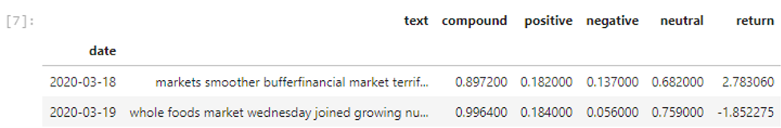

_**Featuring Lags**_

Lagging days feature is incorporated into the `get_model_data` function:

<details><summary>
def get_model_data(company, ticker, lag=0):
</summary>

```python
 # shifting the return column up to adjust for a lag in stock reaction to sentiments
    final_df = cleaned_df(combined_df)
    final_df['return'] = final_df['return'].shift(-lag)
    final_df.dropna(inplace=True)
```

</details>

**Limitations**

* Lack of affordable availability of _**historical intraday stock price**_ data
    * Had to change scope of project from intraday predictions to day over day

* News API only allows for _**30 days of historical articles**_ to be pulled in
    * Limited training data likely affects the accuracy of our model

**Sources**

* _**IEX Finance**_ - historical stock price data
* _**News API / Reuters**_ - historical news articles 


## **Models**

We are prediction whether the closing price of a stock would rise (1) or fall (-1) compared to the closing price of the previous trading day. It is _**supervised machine learning**_ as we have a target variable.  A _**30% training-and-testing split**_ is applied to fit the models.

As of models, we used _**Logit regression**_ and _**Balanced Random Forest Classifier**_ to predict the probability of the binary outcome.

Other models used include _**LSTM Sequential**_ and _**3-Layer Neural Network**_.

### _**Python Libraries**:_

_For Logit and Balanced Random Forest Models:_

[scikit-learn](https://scikit-learn.org/stable/)

_For Neural Network Sequential and LSTM Models:_

[keras](https://keras.io/) 

[tensorflow](https://www.tensorflow.org/)


### _**Evaluation Results: Which Model Shall We Use?**_

_**Based on 31 days of data for Disney (DIS): 3/15/2020 to 4/15/2020**_

_Note: Changes on test statistics based on live data may lead to different choice of models._

_**a. Logit Regression**_
* The `balanced accuracy score` is 0.83.

<details><summary>
Evaluation (click me)
</summary>


</details>

<details><summary>
Code (click me)
</summary>

```python
# ********* MODEL FITTING *************
   # --------- Loigt -----------
   # --------Start-------------
   
M = 'Logit'
from sklearn import linear_model 
lm = linear_model.LogisticRegression(C = 1e5)
lm.fit(X_train, y_train)
lm_pred = lm.predict(X_test)


  # --------- Logit ------------
   # ---------End -------------

```
</details>


_**b. Balanced Random Forest Classifier Ensemble Learning**_
* The `balanced accuracy score` is 0.67.
* Better choice over Decision Tree model as it prevents _**overfitting**_
<details><summary>
Evaluation
</summary>


</details>

<details><summary>
Code
</summary>

```python

# ********* MODEL FITTING *************
   # -----Balanced Random Forest -------
   # --------Start-------------

# Resample the training data with the RandomOversampler
# fit Random Forest Classifier
from imblearn.ensemble import BalancedRandomForestClassifier
brf = BalancedRandomForestClassifier(n_estimators=100, random_state=42)
brf.fit(X_train, y_train)
brf_pred = brf.predict(X_test)

   # --- Balanced Random Forest --------
   # --------End-------------

```
</details>


_**c. Decision Tree Resampling**_
* The `balanced accuracy score` is 0.67.

<details><summary>
Evaluation
</summary>


</details>

<details><summary>
Code
</summary>

```python

# ********* MODEL FITTING *************
   # ----- Decision Tree -------
   # --------Start-------------

from sklearn import tree
# Needed for decision tree visualization
import pydotplus
from IPython.display import Image

# Creating the decision tree classifier instance
model_tree = tree.DecisionTreeClassifier()
# Fitting the model
model_tree = model_tree.fit(X_train, y_train)
# Making predictions using the testing data
tree_pred = model_tree.predict(X_test)

  # --- Decision Tree --------
   # --------End-------------

```

</details>

<details><summary>
Image
</summary>


</details>

#### Data Preparation for Models

<details><summary>
Code 
</summary>

```python

# Creating training and testing data sets
from sklearn.model_selection import train_test_split
X_train, X_test, y_train, y_test = train_test_split(X, y, test_size = 0.3, shuffle=False, random_state=42) 

# For neural network sequential, LSTM and ensemble learning
#Create the StandardScaler instance
scaler = StandardScaler()
# Fit the Standard Scaler with the training data
X_scaler = scaler.fit(X_train)

# Scale the training data - only scale X_train and X_test data 
X_train_scaled = X_scaler.transform(X_train)
X_test_scaled = X_scaler.transform(X_test)


# Creating validation data sets for deep learning on neural network model training
from sklearn.model_selection import train_test_split
X_train, X_val, y_train, y_val = train_test_split(X_train, y_train, test_size = 0.3, shuffle=False) 


```
</details>

#### Model Evaluation

* Confusion Matrix and Balanced Accuracy Scores for Logit, Supervised Resampling and Ensemble Learning

<details><summary>
Code
</summary>


```python
# Score the accuracy
print("Training vs. Testing - Logit")
print(f"Training Data Score: {lm.score(X_train, y_train):,.04f}")
print(f"Testing Data Score: {lm.score(X_test, y_test):,.04f}")

# Evaluating the Logit model in a nicer format
# Calculating the confusion matrix
cm_lm = confusion_matrix(y_test, lm_pred)
cm_lm_df = pd.DataFrame(
    cm_lm, index=["Actual -1", "Actual 1"], columns=["Predicted -1", "Predicted 1"]
)
# Calculating the accuracy score
acc_lm_score = balanced_accuracy_score(y_test, lm_pred)

# Displaying results
print("Confusion Matrix - Logit")
display(cm_lm_df)
print(f"Balanced Accuracy Score : {acc_lm_score:,.04f}")
print("Classification Report - Logit")
print(classification_report(y_test, lm_pred))

```
</details>

## **Results: Real vs. Predicted**

### _**Logit**_

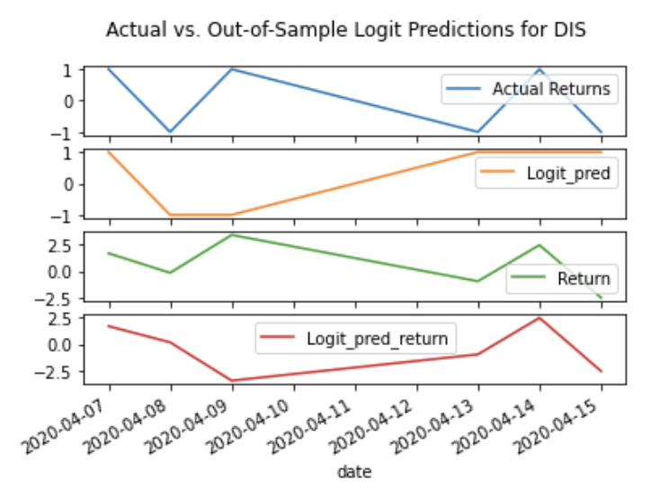

### _**Balanced Random Forest**_
<details><summary>
Graph
</summary>

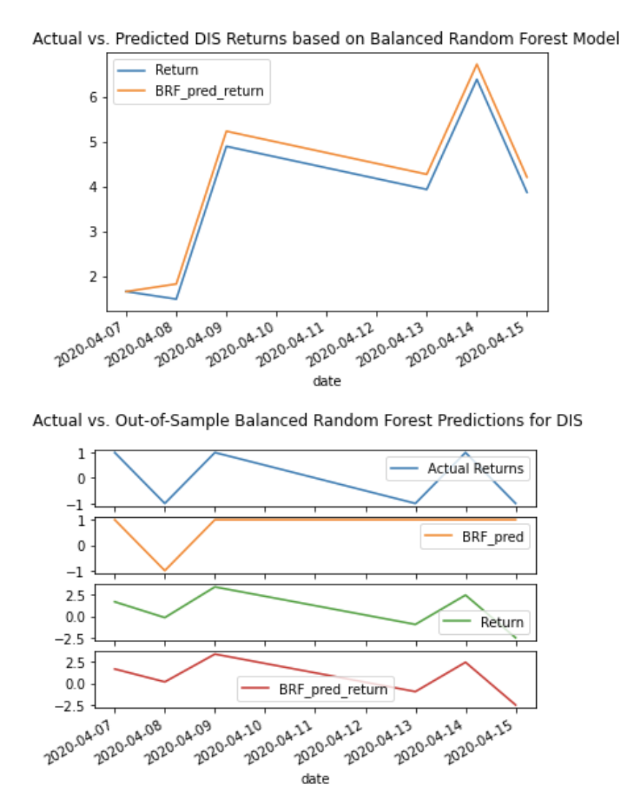
</details>


### _**Three-layer Neural Network**_

<details><summary>
Graph
</summary>

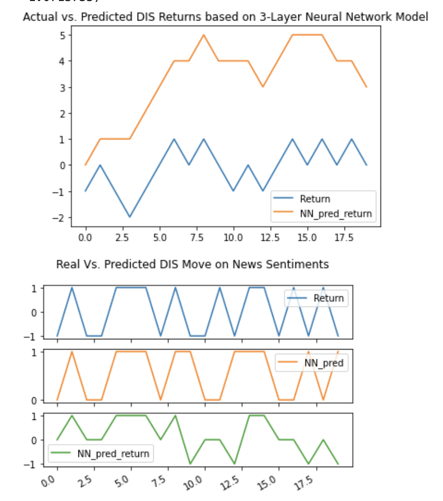

</details>

### _For more details on models, please click on the link below:_
[Test Folder](test)


## **Conclusions** 

### **Impact of Positive vs. Negative News Sentiments**
```
Conclusion: Predictions are more consistent with actual directions of returns based on negative compared to positive sentiments, subject to overfitting.
```

**Deep Learning LSTM Model**

_**Positive News Sentiments**_


_**Negative News Sentiments**_


_Note: Potentially overfitting. Needed more data._

```
The plots of parallel categories and OLS regressions below shows consistent conclusion that negative and compound sentiment scores hold higher predictive power on the direction of daily returns.
```

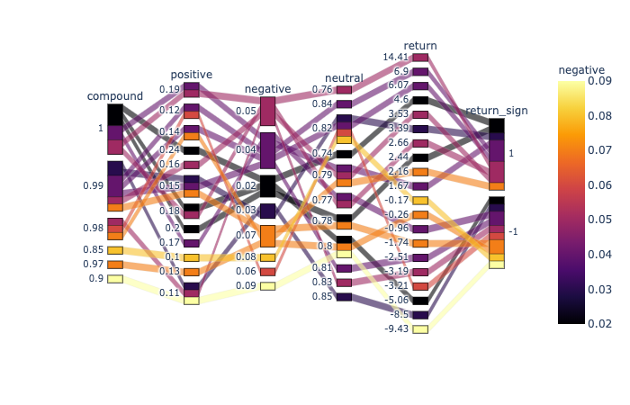

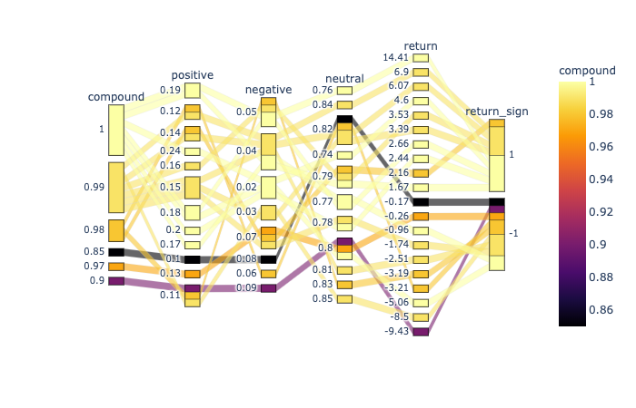

<details><summary>
Compared to positive and neutral sentiments:
</summary>

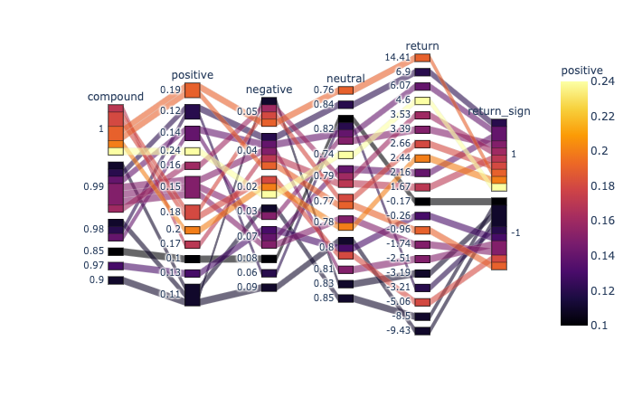

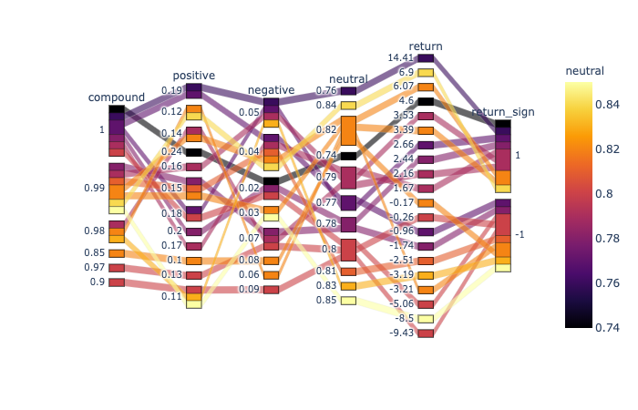

</details>

_**OLS Prediction on Price Move Directions due to News Sentiments in the Past 5 Days**_

Actual Returns (_the blue line on top_) in more in tune with the predictions according to negative sentiments (_the purple line, third from the bottom_) and compound sentiments (_the brown line, second from the bottom_) over the past five trading days. 


<details><summary>
OLS Predicted Returns on News Sentiments in the Past 5 Days
</summary>


_Note: Inverted due to complications when multiplying positive and negative signs._
</details>

### _**Snoozed Sentiments? For How Long?**_
_Impact on Lagged Response to News Sentiments_

**Conclusion:** We found that news sentiments over the past five trading days has identical predictive capacity to one-day sentiments. 

##### **OLS with Rolling One-day Training Window**


<details><summary>
OLS Returns with Rolling Three-day Training Window
</summary>


</details>

##### **OLS with Rolling Five-day Training Window**


_**Discussions**_

Gradient Boosing Ensemble and SVM Models also provides higher accuracy scores (50%) compared to other models.

##### **Gradient Boosting Ensemble Learning on News Sentiments**


##### **Returns from predicted directions: does multiplication always work?**
What happens when multiplying a prediction of price drop, i.e. _-1_, with a negative actual return? Please click below to see a solution.

<details><summary>
Code
</summary>

```python
sigma = (dis['return']/100).std()
all_predic = all_pred
all_predic['OLS_predi'] = 0.7 * sigma * (-all_predic['OLS_pred'])
```
</details>


#### _Interpretation on Test Statistics_

> _**Confusion Matrix**_
> |                   | Predicted 0 (-1) | Predicted 1  |
> |-------------------|------------------|------------- |
> |  Actually 0 (-1)  |      TN          |     FP       |
> |  Actually 1       |      FN          |     TP       |

* **Accuracy = (TP+TN)/(TP+TN+FP+FN)** 
    * It treats FP and FN equally and would be biased for imbalanced data:
        * More weights are put on true negatives (TN)s for COVID-19 tests
        * Tests need to focus on minimizing false negatives (FN)
    * Therefore, other test statistics need to be considered

<details><summary>
Graph Illustration
</summary>

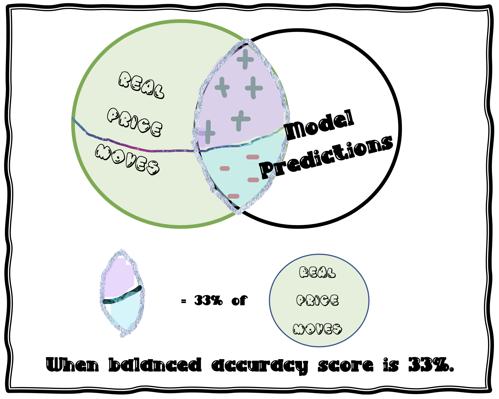
</details>

<details><summary>
Other Model Evaluation Statistics (click me)
</summary>

* **Precision = TP/(TP+FP)**
    * Out of all the predictions of "1" for daily price increase, how many are actually increased.
    * It focuses on the data on price increase and uses figuress in the second column of the confusion matrix.

* **Recall = TP/(TP+FN)**
    * How many actual daily price increase moves are predicted correctly?
    * It features the second row of the confusion matrix 
    * Recall is also the _**sensitivity**_ of the testing model

* **Specificity = TN/(TN+FP)**
    * How many of the actuall downward price moves are predicted correctly?
    * It spotlight the first row of our confusion matrix and examine only the downward price moves in our data.

* **F1 = 2 x (Precision x Recall)/(Precision + Recall)**
    * F1 score is the harmonic mean of precision and recall.
    * As precission and recall usually go in opposite directions, f1 score is a good balance between the two.
    * F1 leverages the second row and column for actual and predicted upward price moves.

</details>

## Deployment

```
Jupyter Lab, Jupyter Notebook, Visual Studio Code
```

## Built With

* [Ipywidget](https://ipywidgets.readthedocs.io/en/latest/) 
* [Panel](https://panel.holoviz.org/) 

## Future Steps
* Our group has been working on several solutions to incorporate _**Buy, Sell and Hold**_ feature into the master function widget. 

<details><summary>
The original code appears as follows:
</summary>

```python
def signal_column(df):
    df['test'] = None
    for index, row in df.iterrows():
        if pd.isnull(row['test']):
            if df.loc[index]['return'] >= 2:
                df.at[index, 'test'] = 1
            elif df.loc[index]['return'] <= -2:
                df.at[index, 'test'] = -1
            else:
                df.at[index, 'test'] = 0
    return df

```

</details>

Trying to fit it in, we tried three versions below

<details><summary>
a. on get_model_data(company, ticker, lag=0) function
</summary>

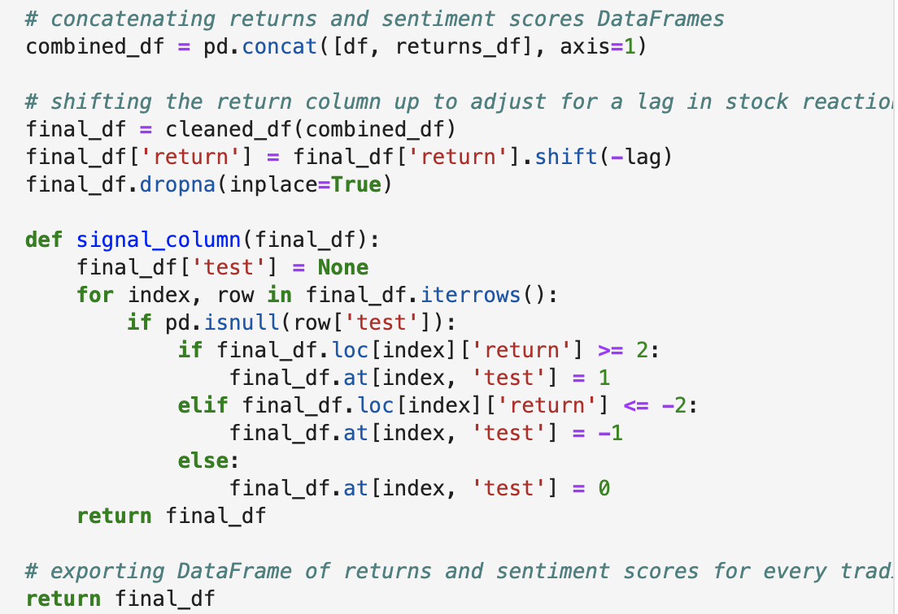

</details>

<details><summary>
b. on on_button_clicked(b) function
</summary>

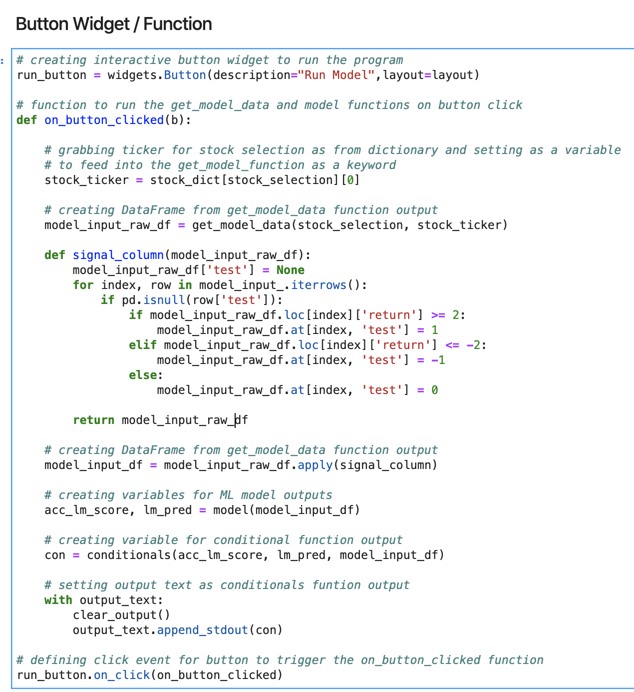

</details>


<details><summary>
c. on the model(df) function

</summary>

```python

# defining model to run Logit logistic regression model on the feature/target DataFrame
# and export predicted price movement and model accuracy
def model(df):
    # preparing the dataframe
    df['return_sign'] = None
    for index, row in df.iterrows():
        if pd.isnull(row['return_sign']):
            if df.loc[index]['return'] >= 2:
                df.at[index, 'return_sign'] = 1
            elif df.loc[index]['return'] <= -2:
                df.at[index, 'return_sign'] = -1
            else:
                df.at[index, 'return_sign'] = 0
    df = df.drop(columns=['text'])
    # creating the features (X) and target (y) sets
    X = df.iloc[:, 0:4]
    y = df["return_sign"]
    # creating training and testing data sets
    X_train, X_test, y_train, y_test = train_test_split(X, y, test_size = 0.3, shuffle=False, random_state=42)
    # fitting model
    M = 'Logit'
    lm = linear_model.LogisticRegression(solver = 'lbfgs')
    lm.fit(X_train, y_train)
    lm_pred = lm.predict(X_test)
    # calculating confusion matrix
    cm_lm = confusion_matrix(y_test, lm_pred)
    cm_lm_df = pd.DataFrame(
    cm_lm, index=["Actual -1", "Actual 1"], columns=["Predicted -1", "Predicted 1"]
    )
    # calculating the accuracy score
    acc_lm_score = balanced_accuracy_score(y_test, lm_pred)
    # exporting model accuracy and predicted price movement float variables as output
    return acc_lm_score, lm_pred[-1]

```
</details>

APIs ran out as of the date of this readme file. It remains unknown whether the buy-sell-hold feature works. 

[Click here for latest version Featuring Buy Sell and Hold](project_code/future_steps/maui_buy_sell_hold.ipynb)

Furthermore, we discussed about options based on Black-Scholes Pricing and showcase put-call parity. It features an interactive input function. Outputs include prices on put and calls with greeks to measure price sensitivities. 

[Click here for latest version on options feature](project_code/future_steps/test_options.ipynb)


Another topic that we spoke about was an Amazon Lex Bot.

[Click here for latest version on Lambda function for Amazon Bot](project_code/future_steps/lambda_function.py)


## Contributors

* Richard Bertrand
* Ava Lee
* Devin Nigro
* Brody Wacker

# Files
### _**Data**_
[Dataframe](project_code/df_function.ipynb)

[Stock Data](project_code/maui_stock_data.ipynb)

### _**Model**_
[Models of Good Fit](test/Code/test_models.ipynb)

[Scikit-learn Classifiers](test/Code/test_supervised.ipynb)

[Neural Net](test/Code/test_nn.ipynb)

[LSTM](test/Code/test_lstm_pos_neg.ipynb)


### _**Future Steps**_

[Future Steps](project_code/future_steps)


# References

* CU Gitlab Repository
* https://machinelearningmastery.com/learning-curves-for-diagnosing-machine-learning-model-performance/
* https://stackoverflow.com/questions/46040656/binary-keras-lstm-model-does-not-output-binary-predictions
* https://pandas.pydata.org/pandas-docs/stable/reference/api/pandas.get_dummies.html
* https://medium.com/@deallen7/managing-date-datetime-and-timestamp-in-python-pandas-cc9d285302ab
* https://stackoverflow.com/questions/38067704/how-to-change-the-datetime-format-in-pandas
* https://pandas.pydata.org/pandas-docs/stable/reference/api/pandas.Timestamp.html
* "Stock Market Prediction" by The Python Quants from ML Elective for CQF
* https://imbalanced-learn.readthedocs.io
* https://scikit-learn.org/stable/
* https://towardsdatascience.com/adaboost-for-dummies-breaking-down-the-math-and-its-equations-into-simple-terms-87f439757dcf
* https://pandas.pydata.org/pandas-docs/version/0.23.4/generated/pandas.get_dummies.html
* https://www.geeksforgeeks.org/python-pandas-series/
* https://machinelearningmastery.com/random-oversampling-and-undersampling-for-imbalanced-classification/
* https://machinelearningmastery.com/combine-oversampling-and-undersampling-for-imbalanced-classification/
* https://machinelearningmastery.com/roc-curves-and-precision-recall-curves-for-classification-in-python/
* https://towardsdatascience.com/decision-trees-and-random-forests-df0c3123f991
* https://docs.scipy.org/doc/numpy/reference/generated/numpy.ravel.html#numpy.ravel
* https://www.scikit-yb.org/en/latest/api/classifier/classification_report.html
* https://www.npr.org/sections/health-shots/2020/04/15/834497497/antibody-tests-for-coronavirus-can-miss-the-mark

